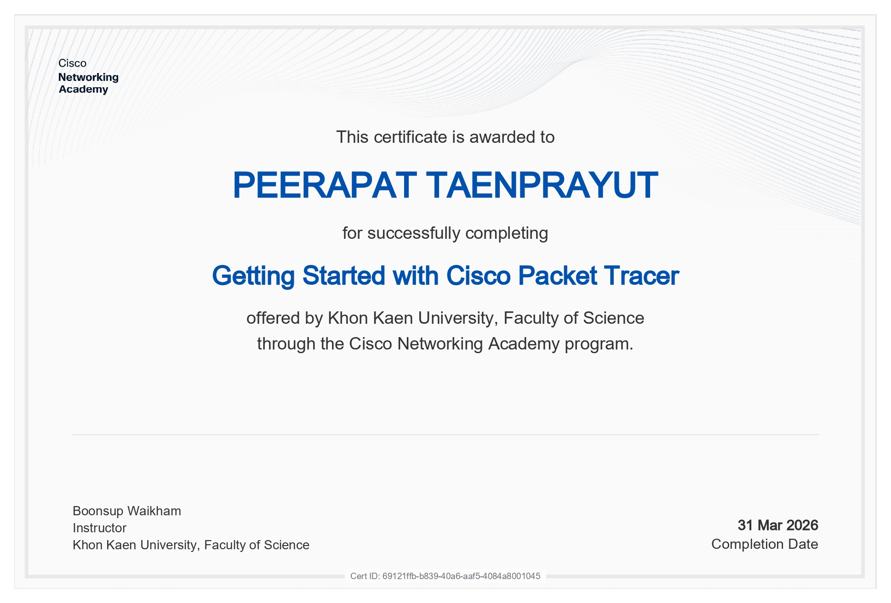

# 🚀 Network Portfolio

### 👤 Info
* **Name:** นายพีรพัฒน์ แท่นประยุทธ
* **Student ID:** 673380288-6
* **Section:** 2

---

### 🧪 Personal Assignments

| Assignment | Link |
| :--- | :--- |
| **Essay** | [View Repo](https://docs.google.com/document/d/1iWTPFNY8Tv89e6WC27rkXwpOMgf08jy6_isgZMUe8L4/edit?usp=sharing) |
| **Topology** | [View Repo](https://docs.google.com/document/d/1MsX1yQ6nzmaZUJmxBmxbNdu_tFS6KLxllPseDvmAgdA/edit?usp=sharing) |
| **Not_Simple** | [View Repo](https://docs.google.com/document/d/1my7_Aklk49rph26YWGaUowLJgfuUAiDMFDixMdt1Wkg/edit?usp=sharing) |
| **TCP-UDP** | [View Repo](https://docs.google.com/document/d/1bzgJZ0ytaKdyEY_C5wUu9bCQ8kLmA9VHajaO_9wbPpw/edit?usp=sharing) |
| **LAB4** | [View Repo](https://docs.google.com/document/d/1vEmWyvEqgFgjgXXdpTUDHExy72YxGuNvlBE9xigtt2s/edit?usp=sharing) |

---

### 👥 Group Assignments

| Assignment | Link |
| :--- | :--- |
| **LAB1** | [View Repo](https://docs.google.com/document/d/1CuFMpCdbbVWx6gqzOhGfBZptw7b1v-DY4cGacJzp8Tw/edit?usp=sharing) |
| **LAB1** | [View Repo](https://docs.google.com/document/d/1M1TbAzRN5niSwk0gXhkETBWikQgHy-IJjH47s5qbfDc/edit?usp=sharing) |
| **LAB1** | [View Repo](https://docs.google.com/document/d/1gdskpdK1Js8NBhjNEyqOABlLf61I_3X2/edit?usp=sharing&ouid=110956833988183028083&rtpof=true&sd=true) |
| **LAB1** | [View Repo](https://docs.google.com/document/d/1NJnRJEsZ7ckoM6w7Vkn80CA0OOFWpjfKEOCZHGylDng/edit?usp=sharing) |
| **NEW NETWORK** | [View Repo](https://drive.google.com/drive/folders/1T7mf2aWWHqJ6W7vkmb3mFaj8Ckf7KNAy?usp=sharing) |

---

### 🏆 Final Project: Synaptic eXtended Augmentation Network
> **The Pitch:** สถาปัตยกรรมเครือข่ายที่ออกแบบมาเพื่อ แปลงสัญญาณชีวภาพ จากร่างกายมนุษย์ (แรงกด, จังหวะประสาท, ตำแหน่งร่างกาย, ชีพจร) ให้กลายเป็น Packet ดิจิทัล ที่ส่งผ่านโปรโตคอล S-XNP v2.0

* [**Project**](https://github.com/MammamiaPizza/Synapse-X_network)

### 📜 Certificate

---
### ✅ Check Point

---
